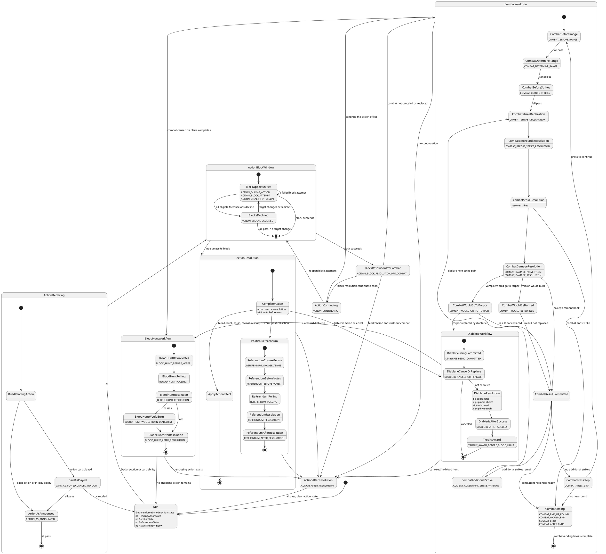

# Timing Windows — Implementation

Documents the rules-enforced workflow windows used to decide when a card or effect can be played. This is an implementation taxonomy, not a replacement for card text: card text remains authoritative and may create narrower timing inside one of these windows.

See [Card Play](./card-play.md) for type and phase gates, [Actions](./actions.md) for the action lifecycle, [Combat](./combat.md) for combat state, and [Referendums](./referendums.md) for political actions and blood hunts.

---

## Principles

- A card's **initial play window** is the window where that card leaves hand or another legal source and is declared.
- Effects created after the card is in play are not part of the card's initial play window. For example, equipment is initially played as a minion-phase action, even if it later grants a combat strike.
- A workflow may open nested workflows. Combat can open diablerie; diablerie opens blood hunt; a political action opens a referendum.
- Replacement and interruption windows happen before the pending result is committed. For example, `COMBAT_WOULD_GO_TO_TORPOR` opens before the vampire is moved to TORPOR.

---

## Workflow Ownership

| Concern                                                            | Owning document / state                                    |
|--------------------------------------------------------------------|------------------------------------------------------------|
| Card leaves hand, as-played cancellation, replacement, destination | [Card Play](./card-play.md)                                |
| Declaring actions, NRA, action success, after-resolution           | [Actions](./actions.md) / `PendingActionState`             |
| Block attempts, stealth/intercept, redirects, blocks declined      | [Blocking](./blocking.md) / `PendingActionState`           |
| Range, strikes, damage, presses, combat ending                     | [Combat](./combat.md) / `CombatState`                      |
| Diablerie sequence and blood hunt trigger                          | [Combat](./combat.md#diablerie) or future `DiablerieState` |
| Political and blood hunt polling/tally                             | [Referendums](./referendums.md) / `ReferendumState`        |
| Cross-workflow order and canonical window names                    | This document                                              |

The workflow owner opens and closes timing windows. [Card Play](./card-play.md) validates that the chosen card mode is legal in the current window and then handles declaration, cancellation, replacement, cost, and destination.

---

## Active Timing Window

Rules-enforced card play should validate against a single active timing surface. At any moment, at most one of these should be open for card/effect play:

```text
ActiveTimingWindow
  workflow: ACTION | BLOCKING | COMBAT | REFERENDUM | DIABLERIE | BLOOD_HUNT
  windowType: CARD_AS_PLAYED_CANCEL_WINDOW | ACTION_AS_ANNOUNCED | ...
  prioritySystem: IMPULSE | SEQUENCING | DETERMINISTIC
  actingPlayer: String
  priorityHolder: String?
  sourceStateRef: PendingActionState | CombatState | ReferendumState | DiablerieState?
  allowedCardTypes: Set<CardType>
  allowedModePredicates: card-text/mode checks for the exact window
```

A card mode is playable only if all layers pass:

1. Source region is legal.
2. Phase, type, and actor gates pass.
3. Requirements are met and declaration costs are payable.
4. The current `ActiveTimingWindow` permits that mode.
5. The player holds the active impulse or sequencing priority, unless the command is deterministic or administrative.

This separates generic card lifecycle from workflow timing. For example, a reaction card is not legal merely because the game is in the minion phase and the player is not the acting player; it must also match the active action, block, referendum, or as-played window.

---

## Unified Action State Diagram

The canonical diagram source is [action-state-machine.puml](./action-state-machine.puml). It is mirrored below as PlantUML for IDEs and Markdown viewers that support PlantUML blocks.



Render the standalone file with PlantUML when a static asset is needed:

```bash
plantuml -tsvg docs/implementation/action-state-machine.puml
```

---

## Action Workflow

```text
1. Declare action
   - If an action card is played:
     CARD_AS_PLAYED_CANCEL_WINDOW

2. Action is announced
   ACTION_AS_ANNOUNCED

3. During action and block attempts
   ACTION_DURING_ACTION
   ACTION_BLOCK_ATTEMPT
   ACTION_STEALTH_INTERCEPT

4. All eligible blockers decline
   ACTION_BLOCKS_DECLINED

5A. If unblocked
   ACTION_RESOLUTION_SUCCESS

5B. If blocked
   ACTION_BLOCK_RESOLUTION_PRE_COMBAT
   -> enter Combat Workflow

6. After action resolution
   ACTION_AFTER_RESOLUTION
```

`ACTION_BLOCK_RESOLUTION_PRE_COMBAT` is a narrow implementation hook for card text playable after a block succeeds but before the resulting combat starts, including text such as "play before combat" or "when this vampire is successfully blocked." It is not a general official phase where arbitrary action modifiers or reactions become legal.

---

## Combat Workflow

```text
1. Combat starts

2. Round begins
   COMBAT_BEFORE_RANGE

3. Determine range
   COMBAT_DETERMINE_RANGE

4. Before strikes
   COMBAT_BEFORE_STRIKES

5. Choose / declare strikes
   COMBAT_STRIKE_DECLARATION

6. Before strike resolution
   COMBAT_BEFORE_STRIKE_RESOLUTION

7. Resolve strikes

8. Damage prevention and damage handling
   COMBAT_DAMAGE_PREVENTION
   COMBAT_DAMAGE_RESOLUTION

9. If the result would move a vampire to torpor
   COMBAT_WOULD_GO_TO_TORPOR

10. If the result would burn a minion
   COMBAT_WOULD_BE_BURNED

11. Commit final result
   - vampire moves to TORPOR
   - minion moves to ASH_HEAP
   - minion remains ready

12. Additional strikes, if applicable
   COMBAT_ADDITIONAL_STRIKE_WINDOW
   -> repeat strike declaration and resolution for additional strikes

13. Press step
   COMBAT_PRESS_STEP

14. End of round
   COMBAT_END_OF_ROUND

15. If no new round
   COMBAT_WOULD_END
   COMBAT_ENDS
   COMBAT_AFTER_ENDS

16. Return to enclosing workflow
   - if a card/effect continues the action: ACTION_CONTINUING
   - otherwise: ACTION_AFTER_RESOLUTION, if combat was nested in an action
```

`COMBAT_WOULD_GO_TO_TORPOR` and `COMBAT_WOULD_BE_BURNED` are result-replacement hooks inside combat. They are not diablerie hooks by themselves. Cards such as `Decapitate`, `Amaranth`, `Ashes to Ashes`, and `Reform Body` use these windows because they replace a pending torpor or burn result before it is committed.

---

## Combat-Caused Diablerie Workflow

Combat can create diablerie by replacing a torpor result or by another card-specific combat result. Once that happens, diablerie runs as a nested workflow.

```text
1. Combat result would move a vampire to torpor
   COMBAT_WOULD_GO_TO_TORPOR

2. A card or effect replaces torpor with diablerie

3. Diablerie begins
   DIABLERIE_BEING_COMMITTED

4. Diablerie cancellation/replacement
   DIABLERIE_CANCEL_OR_REPLACE

5. If not canceled, resolve diablerie
   - transfer victim blood
   - diablerist may take equipment
   - burn victim
   - discipline search, if applicable

6. After successful diablerie
   DIABLERIE_AFTER_SUCCESS

7. Red List Trophy award, if applicable
   TROPHY_AWARD_BEFORE_BLOOD_HUNT

8. Blood hunt referendum begins
   -> enter Blood Hunt Workflow
```

`DIABLERIE_BEING_COMMITTED` belongs to the diablerie workflow, regardless of whether diablerie came from combat, a directed action, a blocked leave-torpor action, or card text.

---

## Action-Caused Diablerie Workflow

```text
1. Declare diablerie action or action effect
   CARD_AS_PLAYED_CANCEL_WINDOW, if a card is played

2. Run normal action workflow
   ACTION_AS_ANNOUNCED
   ACTION_DURING_ACTION
   ACTION_BLOCK_ATTEMPT
   ACTION_BLOCKS_DECLINED

3. If the action succeeds
   ACTION_RESOLUTION_SUCCESS

4. Diablerie begins
   DIABLERIE_BEING_COMMITTED

5. Diablerie cancellation/replacement
   DIABLERIE_CANCEL_OR_REPLACE

6. Resolve diablerie

7. After successful diablerie
   DIABLERIE_AFTER_SUCCESS

8. Red List Trophy award, if applicable
   TROPHY_AWARD_BEFORE_BLOOD_HUNT

9. Blood hunt referendum begins
   -> enter Blood Hunt Workflow

10. After action resolution
   ACTION_AFTER_RESOLUTION
```

For a blocked leave-torpor action, the blocker may choose diablerie instead of combat. That choice enters the diablerie workflow at `DIABLERIE_BEING_COMMITTED`.

The diablerie workflow owns the blood hunt trigger regardless of source. `ResolveAction` may create an action-caused diablerie, but it should not be the only code path that opens blood hunt.

---

## Political Referendum Workflow

```text
1. Political action succeeds

2. Choose terms
   REFERENDUM_CHOOSE_TERMS

3. Before votes and ballots
   REFERENDUM_BEFORE_VOTES

4. Polling
   REFERENDUM_POLLING

5. Tally votes and determine result
   REFERENDUM_RESOLUTION

6. Outcome-dependent referendum hooks
   REFERENDUM_AFTER_RESOLUTION

7. After action resolution
   ACTION_AFTER_RESOLUTION
```

Action modifiers and reactions that say "during a political action", "during a referendum", or "during the polling step" belong to the referendum workflow, not to ordinary stealth/intercept block-attempt timing.

---

## Blood Hunt Workflow

Blood hunt is referendum-like, but it is not a political action.

```text
1. Blood hunt is called after diablerie

2. Before votes and ballots
   BLOOD_HUNT_BEFORE_VOTES

3. Polling
   BLOOD_HUNT_POLLING

4. Tally votes and determine result
   BLOOD_HUNT_RESOLUTION

5. If the blood hunt passes and would burn the diablerist
   BLOOD_HUNT_WOULD_BURN_DIABLERIST

6. Commit final result
   - diablerist burns
   - diablerist survives

7. After blood hunt
   BLOOD_HUNT_AFTER_RESOLUTION
```

`BLOOD_HUNT_WOULD_BURN_DIABLERIST` is distinct from `COMBAT_WOULD_BE_BURNED`. The former is caused by a referendum result after diablerie; the latter is caused by combat damage or combat effects before the combat result is committed.

---

## Initial Card-Play Window Examples

| Example card / mode                         | Initial window                         | Notes                                                              |
|---------------------------------------------|----------------------------------------|--------------------------------------------------------------------|
| `.44 Magnum` as Equipment                   | `MINION_PHASE_DECLARE_ACTION`          | Later strike/maneuver text is generated by the equipped card       |
| Standard Master                             | `MASTER_PHASE`                         | Unless card text says out-of-turn                                  |
| Event                                       | `DISCARD_PHASE_EVENT`                  | Uses the discard phase event play                                  |
| `Direct Intervention` style canceller       | `CARD_AS_PLAYED_CANCEL_WINDOW`         | Restricted cancellation layer                                      |
| `Freak Drive`                               | `ACTION_AFTER_RESOLUTION`              | After action resolves                                              |
| `Deflection` style bleed redirect           | `ACTION_BLOCKS_DECLINED`               | When text says after blocks are declined                           |
| `Carrion Crows`                             | `COMBAT_BEFORE_RANGE`                  | Explicit before-range combat card                                  |
| `Blur`                                      | `COMBAT_ADDITIONAL_STRIKE_WINDOW`      | Additional-strike source                                           |
| `Amaranth`                                  | `COMBAT_WOULD_GO_TO_TORPOR`            | Replaces pending torpor with diablerie                             |
| `Crimson Fury`                              | `DIABLERIE_BEING_COMMITTED`            | Responds to a vampire being diablerized                            |
| `Lay Low`                                   | `BLOOD_HUNT_WOULD_BURN_DIABLERIST`     | Responds to blood hunt passing and burning the diablerist          |

---

## Naming Guidance

Prefer specific workflow windows over broad "interrupt" names. Specific names make legality checks easier to implement and test:

| Prefer                                      | Avoid as canonical implementation state        |
|---------------------------------------------|------------------------------------------------|
| `COMBAT_WOULD_GO_TO_TORPOR`                 | `COMBAT_BURN_OR_TORPOR_REPLACEMENT`           |
| `COMBAT_WOULD_BE_BURNED`                    | `COMBAT_EVENT_REPLACEMENT_OR_INTERRUPTION`    |
| `DIABLERIE_BEING_COMMITTED`                 | `COMBAT_DIABLERIE_INTERRUPT`                  |
| `BLOOD_HUNT_WOULD_BURN_DIABLERIST`          | `REFERENDUM_INTERRUPT`                        |

Broad names can still be useful for CSV review buckets, but the engine should expose the narrower window that matches the workflow step.
